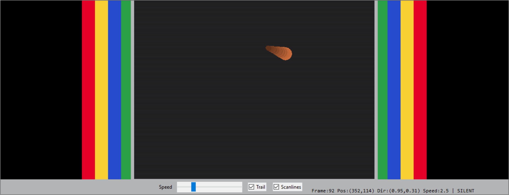
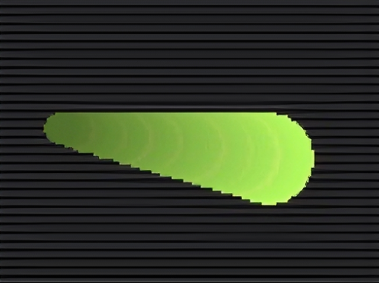
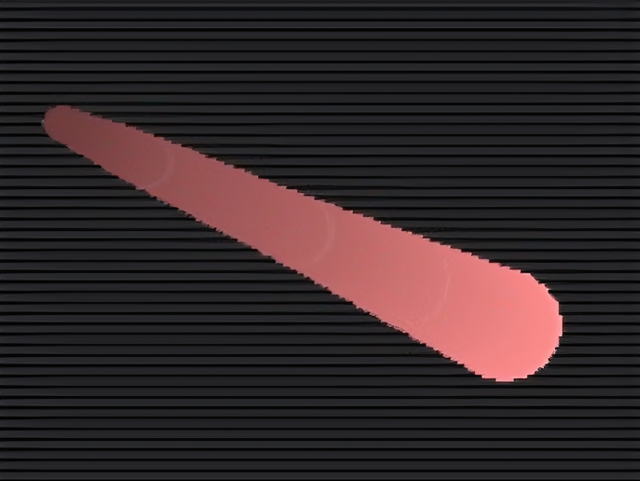

# Idle Screen from zigzag.py

## Fitur

### 🖥️ Idle Screen CRT Retro
Dengan mode otomatis berdasarkan waktu:
- Light Mode: 06:00 – 18:00
- Dark Mode: 18:00 – 06:00

---

### 🔇 Dynamic Reflection & Silent Mode
- Perubahan warna objek setiap pantulan
- Silent Mode (tanpa suara) aktif pada **22:00 – 06:00**

---

### 💨 Speed Boost & Dynamic Trail
Ekor menyesuaikan kecepatan objek:
- Kecepatan rendah → trail pendek
- Kecepatan tinggi → trail panjang

  
  

